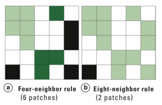

# Introduction to Landscape Metrics {#intro}

Landscape Metrics are simply mathematical formulations to quantify landscape pattern. Metrics can quantify landscape composition (what is on the landscape) or configuration (how the landscape is organized). They should be thought of as descriptive statistics.

The `landscapemetrics` package (by Maximilian Hesselbarth and colleagues) in R lets you run a suite of metrics at the patch, class and landscape scale. Full documentation for the package is [here](https://r-spatialecology.r-universe.dev/landscapemetrics).

This package is designed to run many of the metrics developed by Kevin McGarigal and colleagues that are part of the Fragstats software. You can read more about [Fragstats](https://www.fragstats.org/) if you are interested. If you plan to use landscape metrics in your own research, you should definitely reach up more about these metrics and look at some of Dr. McGarigal's original work. For the purposes of this class, we will just work through a few demonstrations of the metrics to give you a sense of how they work.

If you are not familiar with the basics of R (e.g., installing and loading packages, setting up a working directory) please review the [Quantitative Skills for Biology Guide](https://ahurford.github.io/quant-guide-all-courses/).

```{r, echo=FALSE}
setwd("C:/Users/ywiersma/Documents/GitHub/BIOL-4405/Landscape_Metrics")
```

You need two packages for this exercise, `landscapemetrics` and `raster`
```{r, message = FALSE, warning = FALSE}
library(landscapemetrics)
library(raster)
```

## Key terms to understand

### Patch

An area of the landscape delineated from its surroundings by being relatively more homogeneous within its boundaries than compared to its surroundings. Another way of saying this is a patch is an area of the landscape with a single landcover type.

### Raster map

A raster map is a digital map where the landscape is depicted as pixels. Each pixel has a value assigned to it that describes a landcover type. For example 1 = coniferous forest, 2 = deciduous forest, 3 = water, 4 = urban.

### Neighour rule

How a patch is delineated in a raster map. If using the 4-neighbour rule (rook's case), pixels with the same cover type that are joined in the vertical and/or horizontal directions are considered part of the same patch. That is a pixel with a value of "1" surrounded by 4 pixels on each of the horizontal and vertical sides would all be considered part of the same patch. If using the 8-neighbour rule (queens' case), pixels with the same cover type that are joined in the vertical, and/or horizontal and/or diagonal directions are considered part of the same patch. See diagram below for an illustration.

**NOTE**: `landscapaemetrics` defaults to the eight-neighbour rule in most metrics. To confirm, use the documentation at the `help()` function to see what the defaults are. If you want to change this you will have to modify the argument. We will illustrate this a little later on. 


```{r, echo = FALSE}

```
A diagram depicting the four-neighbour rule (a) vs the eight-neighobur rule (b) for defining landscape patches in a raster map. In (a) there are 6 distinct patches, in (b) there are 2 distinct patches. From Turner (2015).


## Patch-level metrics

Patch level metrics are metrics that describe properties of each individual patch. If you run a patch-level metric you will get as many lines of output as there are patches on the map.

## Class-level metrics

Class level metrics are metrics that describe patterns at each class (class= landcover type). For example, in a simple map that shows forest, agriculture and urban pixels, a class level metric might describe average patch size for each of those 3 classes. If you run a class-level metric, you will get as many lines of output as there are classes on the map.

## Landscape-level metrics

Landscape level metrics describe the entire landscape. If you run a landscape-level metric you get one line of output. 


# A bit more about landscape metrics

There are many, many metrics out there to measure landscape pattern. There are two main categories of metrics:

## Composition metrics 

These metrics describe the composition of the landscape. They measure things like how many patches there are, what percentage of the landscape is covered by each class (cover type).

## Configuation metrics

The metrics describe how patches and cover types are configured. The measure things like the relationship of patches to each other (interpatch distance) or the probability that certain cover types are adjacent to each other. 

To see some of the metrics available in the `landscapemetrics` package, type the code below:

`lsm_abbreviations_names`

The table shows the metric abbreviation, the full name, the type of metric it is and the level (patch, class or landscape) to which it applies. 

Note, the above code only gives a partial list. If you want to see more (say the first 40 metrics), type the following code:

`print(lsm_abbreviations_names, n =40)`


## The sample landscape 

The `landscapemetrics` package includes a sample raster map of an area near Augusta, Gerogia, obtained from the US National Land Cover Database (NLCD). To view that map, type the code below:

```{r}
augusta <- terra::rast(landscapemetrics::landscape)
plot(augusta)
```

We will be working with this landscape to run through some examples of patch, class and landscape level metrics. To use this on you own landscape, you would simply have to import your own landscape raster file into the working director and then apply the functions to it. Simply, where here the functions use the landscape `augusta` in the arguments of the function call; you would use the name of your landscape.  

